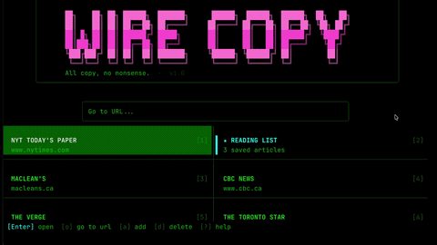

# WireCopy

A quiet, keyboard-driven reader for the web — one screen, no ads, no popovers, no noise.

<p align="center">
  
</p>
<p align="center"><sub><a href="https://cdn.jsdelivr.net/gh/joe-rayment/wire-copy@main/docs/assets/wirecopy.mp4">▶ Watch the demo (1m 10s)</a></sub></p>

## What you can do with it

- **Bookmark your favourite news sites and blogs** and jump straight back to them — no tab bar to wrangle, just a grid of named cards on the launcher.
- **Browse pages from the keyboard** — articles and link lists render as a clean tree without ads, cookie banners, share widgets, or layout chrome. Aggregators like Techmeme and Hacker News work too: outbound story links are treated as the content they are.
- **Keep the real page in view** — the sidecar docks a slim live browser beside the terminal that scrolls to and highlights whatever you select, so you never lose the page's visual context.
- **Let AI lay out a site for you** — press `g l` once per site and the setup wizard reads the page, asks only the questions it genuinely can't answer (each option lights up on the live page — you can click the answer in the browser window), and previews the resulting layout *as the actual link tree* before anything is saved.
- **Read articles in a focused reader view** — pick a comfortable width, search inside the page, tune the extraction visually when a site misbehaves, and turn on speed-reading when you want to skim.
- **Save articles to reading lists** for later, with read / unread tracking and per-item caching so everything still works after you've closed the tab.
- **Turn a reading list into a narrated audiobook** — generate an M4B with chapter markers and (optionally) publish it as a podcast feed so you can subscribe in your podcast app. Generation runs in the background: back out of the progress screen any time and the run keeps going.
- **Schedule recurring episodes** — recipes pull named sections from your sites on a schedule (unattended), assemble an episode, and publish it, with a quality floor so you never get a near-empty one.
- *(advanced)* **Anti-detection browsing** via patched Playwright for sites that block bots, and **paste-once login cookies** (encrypted at rest) for paywalled sources you already pay for.

<p align="center">
  
</p>

For the technically curious: a .NET 10 terminal browser with Helix-style keybindings (`j`/`k`/`h`/`l`/`gg`/`G`), a distraction-free reader view, and a pipeline that turns saved articles into M4B audiobooks with chapter markers and an optional GCS-hosted RSS feed.

> **Note:** When browsing websites with this tool, respect each site's robots.txt and Terms of Service. WireCopy is for educational and personal use.

## Quick Start

```bash
git clone https://github.com/joe-rayment/wire-copy.git
cd wire-copy
./dotnet build
./dotnet run --project src/WireCopy.API
```

The `./dotnet` wrapper bootstraps a workspace-local .NET 10 SDK into `./.dotnet/` on first use — no system-wide dotnet install required. If you'd rather type `dotnet` than `./dotnet`, add the repo root to your PATH: `export PATH="$PWD:$PATH"`.

Podcast generation additionally requires `ffmpeg` on your PATH (`apt install ffmpeg` / `brew install ffmpeg`).

See [docs/SETUP.md](docs/SETUP.md) for full setup, including credential configuration.

## Features

- **Launcher** — Bookmark grid with numbered quick-jump shortcuts, a URL bar, and a one-key Setup screen (`c`)
- **Link Tree** — Browse a page's links in a categorized, collapsible tree (content, navigation, external, footer), with aggregator-aware classification
- **Live browser sidecar** — A phone-width real browser docks beside the terminal, follows your selection, and highlights the story you're on; `y` adopts whatever page you navigated it to
- **AI site setup** (`g l`) — A preview-first wizard infers a durable, reusable layout per site; what you confirm is the real rendered tree, not a description of it
- **Reader View** — Distraction-free article reading with adjustable width, search, speed-reading, and a visual layout tuner (`L`) for stubborn sites
- **Collections** — Save articles to reading lists with read/unread tracking and per-item caching
- **Podcast generation** — Convert a reading list into a narrated M4B with chapter markers; runs in the background with live progress in the status bar
- **Scheduled recipes** — Recurring podcast episodes assembled from named site sections (`:schedule`)
- **Helix-style keybindings** (`j`/`k`, `h`/`l`, `gg`/`G`) and in-page search (`/`, `n`/`N`)
- **Page caching** for instant back/forward navigation, plus background prefetch of likely next reads
- **Anti-detection browsing** via Patchright (patched Playwright) for sites with bot protection

## Site layout setup (`g l`)

Sites vary wildly in how they structure their pages. Press `g l` on any link-list page:

- **Unconfigured site** → a short entry card: *Let AI find the stories* (recommended), *Document order* (every link, no AI), or *Compare all strategies* (probe and preview Document Order / AI Curated / RSS side by side).
- **AI setup** → the model reads the page and proposes a reusable pattern. If it's genuinely unsure between concrete alternatives it asks — at most three questions, each option highlighted live on the sidecar page so you answer by looking (or by clicking the element in the browser window). Then it shows the **result**: the candidate layout applied to the real link tree, with per-section match counts and honest coverage ("124 of 187 story links covered"). `Enter` saves exactly what you see, `Space` adjusts (point at the lead story or steer with free text), `Esc` discards.
- **Self-test gate** — a proposal that matches (almost) none of the page's links is never shown; the wizard automatically retries once with the mismatch fed back, and failing that says so plainly instead of presenting garbage.
- **Already-configured site** → a compact summary with *Reconfigure with AI*, *Reset to document order*, and *Compare all strategies*.

Saved layouts are durable (CSS-selector / URL-pattern based, never tied to specific article URLs) so they keep working as the site's stories change. The AI strategy needs an OpenAI key and costs a few cents per setup; the result is cached per domain. Command-line equivalents: `:layout`, `:layout clear`.

## Audio / Podcast Mode

Generate narrated M4B files from your saved articles. A single **OpenAI** API key powers text-to-speech, the AI site setup, and article extraction.

Press `p` on a reading list. While generating:

| Key | Action |
|-----|--------|
| `Esc` / `b` | Back out — **generation continues** in the background (CTA and status bar show live progress) |
| `Shift+P` | Restore the progress screen for a background run |
| `x` | Cancel the run (asks for confirmation) |

### Setup

The fastest path is the in-app Setup screen — press `c` on the launcher and walk through the rows. Keys are stored encrypted (ASP.NET DataProtection) in `~/.local/share/WireCopy/settings.json` (`$LOCALAPPDATA/WireCopy` on Windows).

If you prefer `dotnet user-secrets` (e.g. during development), that path still works and is read on startup:

```bash
cd src/WireCopy.API
../../dotnet user-secrets init
../../dotnet user-secrets set "OpenAiTts:ApiKey" "sk-..."
```

Cloud publishing of podcast feeds via Google Cloud Storage is optional. To enable it, set `Gcs:BucketName` and either `Gcs:ServiceAccountKeyPath` (path to a JSON service-account key) or grant default credentials. Without a bucket, episodes are generated locally only.

### Cost management

OpenAI calls enforce per-session budget limits configured in `appsettings.json` (`OpenAiTts:MaxBudgetUsd`) and a monthly token cap for the analyzer (`OpenAiHierarchy:MonthlyTokenBudget`). A cost gate asks before unusually expensive runs. Generated audio and AI layouts are cached on disk to avoid regeneration when re-running with the same content.

## Keybindings

Press `?` on any screen for the full, current list.

### Launcher

| Key | Action |
|-----|--------|
| `Enter` | Open selected bookmark |
| `o` | Open URL bar |
| `a` / `d` | Add / delete bookmark |
| `Shift+J` / `Shift+K` | Reorder bookmarks |
| `c` | Setup / settings |
| `1`-`9` | Jump to bookmark by number |
| `Ctrl+P` | Cycle theme |

### Link Tree

| Key | Action |
|-----|--------|
| `j` / `k` or arrows | Navigate links |
| `h` / `l` | Collapse / expand sections |
| `Enter` | Follow selected link |
| `Space` | Toggle expand/collapse · toggle selection |
| `s` / `A` | Save to reading list / save all links |
| `v` / `t` | Reader / tree view |
| `g l` | Set up site layout (AI) — also `:layout` |
| `|` | Dock / undock the live browser sidecar (follows selection) |
| `y` | Open the sidecar's current page in the app |
| `Shift+R` | Force refresh (bypass cache) |
| `Shift+I` | Interactive refresh (log in by hand in the visible browser) |
| `\` | Prefetch progress panel |
| `/` `n` `N` | Search · next / previous match |
| `b` / `Shift+B` | Go back / forward (also `Backspace` = back) |

### Reader View

| Key | Action |
|-----|--------|
| `j` / `k`, `Ctrl+D` / `Ctrl+U` | Scroll · page down / up |
| `[` / `]` / `0` | Narrow / widen / reset content width |
| `e` | Regenerate article layout (re-run the AI extractor) |
| `Shift+E` | Tune article layout visually (headline / body / ignore, confirmed on the live page) |
| `f`, `<` / `>` | Speed reading on/off · slower / faster |
| `s` / `o` | Save to reading list / open in system browser |
| `|` | Dock / undock the live browser sidecar |
| `v` | Back to link view |

### Reading List

| Key | Action |
|-----|--------|
| `Enter` / `d` | Open / remove item |
| `Shift+J` / `Shift+K` | Reorder items |
| `Shift+X` | Clear list (with confirmation) |
| `p` | Generate podcast |
| `Shift+P` | Restore a background podcast run |

### Everywhere

| Key | Action |
|-----|--------|
| `gg` / `G` | Jump to top / bottom |
| `:` | Command line (`:layout`, `:schedule`, `:config`, `:cred`, `:podcast`, `:collections`, …) |
| `Ctrl+P` | Cycle theme |
| `?` | Help |
| `q` / `Ctrl+C` | Quit |

## Themes

WireCopy ships with four color themes, all built on ANSI 256 colors:

| Theme | Description |
|-------|-------------|
| **Phosphor** (default) | Green-on-black CRT aesthetic |
| **Amber** | Warm amber/gold monochrome |
| **Dracula** | Cool gray with cyan and pink accents |
| **Light** | Dark text on light background |

## Configuration

Configuration is loaded from `appsettings.json` and can be overridden with environment variables, `dotnet user-secrets`, or a local `secrets.json` (gitignored — see [`secrets.json.example`](secrets.json.example)).

**Runtime overrides.** The in-app Setup screen (`c` on the launcher) and the `:set <key> <value>` command write to `~/.local/share/WireCopy/settings.json`, which takes precedence over `appsettings.json` for the keys it covers (API keys, GCS bucket, voice, etc.).

| Setting | Description | Default |
|---------|-------------|---------|
| `OpenAiTts:ApiKey` | OpenAI API key (shared by TTS and the analyzer) | (required for audio + AI setup) |
| `OpenAiTts:Model` | TTS model — only the `gpt-4o-mini-tts` family honours `Instructions`; legacy `tts-1` / `tts-1-hd` still work but ignore it | `gpt-4o-mini-tts` |
| `OpenAiTts:Voice` | TTS voice (`alloy`, `ash`, `ballad`, `coral`, `echo`, `fable`, `onyx`, `nova`, `sage`, `shimmer`) | `coral` |
| `OpenAiTts:Instructions` | Style instruction sent to `gpt-4o-mini-tts` (empty = none) | `Speak like a playful but knowing news anchor` |
| `OpenAiTts:MaxBudgetUsd` | Max TTS spend per session | `1.00` |
| `OpenAiHierarchy:Model` | Chat model for AI site setup / extraction | `gpt-5-mini` |
| `OpenAiHierarchy:ReasoningEffort` | Reasoning tier for cheap revisit/classification calls (`minimal` / `low` / `medium`) | `minimal` |
| `OpenAiHierarchy:SetupReasoningEffort` | Reasoning tier for the one-time `g l` site setup (higher = more consistent layouts; revisits never call the model) | `medium` |
| `OpenAiHierarchy:MonthlyTokenBudget` | Per-month cap on analyzer tokens (0 = disabled) | `200000` |
| `Browser:Visibility` | Legacy — **ignored**. The browser is always headful (headless is bot-blocked on the sites this targets); display-less hosts run under a virtual display via the `run` script. Kept only so old settings files still bind | (ignored) |
| `Browser:Sidecar` | Auto-dock the live browser beside the terminal on every page (off = launch parked off-screen; <code>&#124;</code> docks on demand) | `false` |
| `Browser:DockSide` / `Browser:DockWidthPx` | Which edge the sidecar docks to, and how wide (iPhone-SE width) | `Right` / `390` |
| `Browser:TileTerminalWithSidecar` | macOS side-by-side: docking also resizes the terminal to the other half; dismiss restores it. Needs Accessibility permission | `false` |
| `Podcast:Title` | Podcast feed title | `WireCopy Podcast` |
| `Gcs:BucketName` | GCS bucket for podcast feed publishing | (unset → local-only mode) |
| `Gcs:ServiceAccountKeyPath` | Path to GCS service-account JSON key | (unset → default credentials) |

## Authentication for paywalled sites

For sites requiring login, WireCopy supports paste-once session cookies that are encrypted at rest with ASP.NET DataProtection (`:cred add <domain>`), plus `Shift+I` to log in by hand in the visible browser — the session persists in the shared browser profile. See [docs/cookie-encryption.md](docs/cookie-encryption.md) for the flow.

## Project Structure

```
src/
├── WireCopy.Domain/          # Entities (Bookmarks, Browser, Collections, Credentials, Scheduling)
├── WireCopy.Application/     # Service interfaces and DTOs
├── WireCopy.Persistence/     # EF Core DbContext, repositories, UnitOfWork
├── WireCopy.Infrastructure/  # External integrations
│   ├── Browser/                # Patchright automation, link extraction, reader view
│   │   ├── UI/                 # Terminal renderer, input handler
│   │   └── Cache/              # Page cache + background prefetch
│   ├── Podcast/                # OpenAI TTS, FFmpeg, M4B chapter markers, GCS publishing
│   ├── Scheduling/             # Recurring podcast recipes, durable section resolution
│   └── Configuration/          # Options classes and validators
└── WireCopy.API/             # Console application entry point

tests/
└── WireCopy.Tests/           # Unit and integration tests, organized by feature area

scripts/                        # Test runner + live end-to-end gates (tmux-driven)
docs/                           # Setup, testing, architecture, cookie encryption, design
```

## Development

```bash
# Build (workspace-vendored .NET 10 SDK, bootstrapped on first call)
./dotnet build

# Full test suite (~90s)
./scripts/test.sh

# Subsets
./scripts/test.sh --filter "SetupWizard"
./scripts/test.sh --browser
./scripts/test.sh --podcast

# Format
./dotnet format
```

Live end-to-end gates (real sites, real terminal via tmux) live in `scripts/` — e.g. `test_6yb7_techmeme_live.py` walks the AI setup wizard against techmeme.com and `test_vkhr_detach_restore.py` exercises the background-podcast round trip. They require a built Release binary, tmux, and (for AI flows) an OpenAI key.

See [CONTRIBUTING.md](CONTRIBUTING.md) for development conventions.

## Docker

```bash
docker build -t wirecopy:latest .
docker run --rm \
  -e OpenAiTts__ApiKey="sk-..." \
  -v $(pwd)/output:/app/output \
  wirecopy:latest
```

## Issue Tracking

Please use [GitHub Issues](../../issues) to report bugs or request features.

## Technology Stack

- **.NET 10.0** with C# 14
- **[Patchright](https://github.com/Kaliiiiiiiiii-Vinyzu/patchright-dotnet)** — patched Playwright for .NET (CDP-leak patched, ARM64-native)
- **HtmlAgilityPack** for HTML parsing and content extraction
- **OpenAI .NET SDK** — TTS, AI site setup, and article extraction (`gpt-5-mini`)
- **FFMpegCore** for audio processing (requires `ffmpeg` on PATH)
- **z440.atl.core** (ATL.NET) for M4B chapter markers
- **Entity Framework Core 10** + **SQLite** for local persistence
- **ASP.NET DataProtection** for cookie / credential encryption at rest
- **Google.Cloud.Storage** for optional podcast feed publishing
- **Terminal.Gui 2.2** for the terminal UI shell
- **Serilog** for structured logging

## License

[MIT](LICENSE) — see the LICENSE file.
