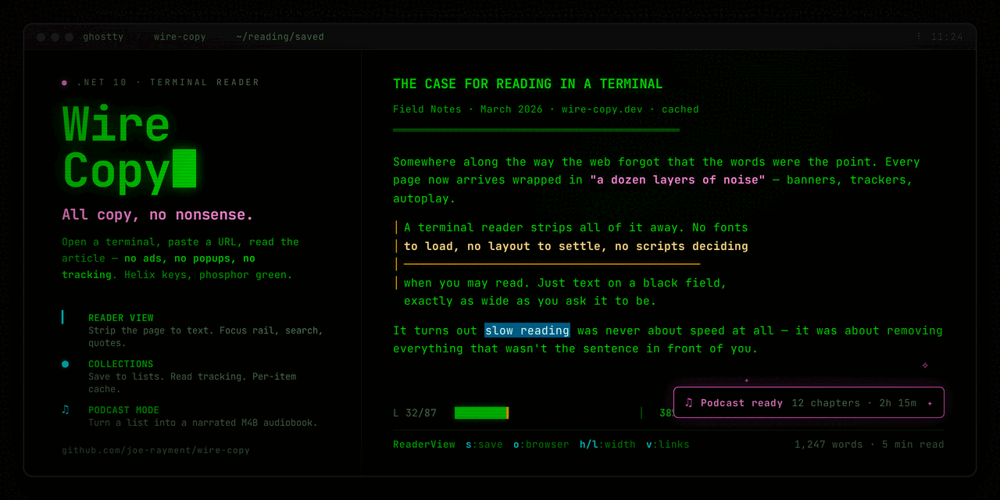

# WireCopy

A quiet, keyboard-driven reader for the web — one screen, no ads, no popovers, no noise.

<p align="center">
  
</p>
<p align="center"><sub><a href="https://cdn.jsdelivr.net/gh/joe-rayment/wire-copy@main/docs/assets/wirecopy.mp4">▶ Watch the demo (1m 10s)</a></sub></p>

## What you can do with it

- **Bookmark your favourite news sites and blogs** and jump straight back to them — no tab bar to wrangle, just a grid of named cards on the launcher.
- **Browse pages from the keyboard** — articles, link lists, and headers show up as a clean tree without ads, cookie banners, share widgets, or layout chrome.
- **Read articles in a focused reader view** — pick a comfortable width, search inside the page, and turn on speed-reading when you want to skim.
- **Save articles to reading lists** for later, with read / unread tracking and per-item caching so everything still works after you've closed the tab.
- **Turn a reading list into a narrated audiobook** — generate an M4B with chapter markers and (optionally) publish it as a podcast feed so you can subscribe in your podcast app and listen on the go.
- *(advanced)* **Anti-detection browsing** via patched Playwright for sites that block bots, and **paste-once login cookies** (encrypted at rest) for paywalled sources you already pay for.

For the technically curious: a .NET 10 terminal browser with Helix-style keybindings (`j`/`k`/`h`/`l`/`gg`/`G`), a distraction-free reader view, and a pipeline that turns saved articles into M4B audiobooks with chapter markers and an optional GCS-hosted RSS feed.

> **Note:** When browsing websites with this tool, respect each site's robots.txt and Terms of Service. WireCopy is for educational and personal use.

## Quick Start

```bash
git clone https://github.com/joe-rayment/wire-copy.git
cd wire-copy
./dotnet build
./dotnet run --project src/WireCopy.API
```

The `./dotnet` wrapper bootstraps a workspace-local .NET 10 SDK into `./.dotnet/` on first use — no system-wide dotnet install required. If you'd rather type `dotnet` than `./dotnet`, add the repo root to your PATH: `export PATH="$PWD:$PATH"`.

See [docs/SETUP.md](docs/SETUP.md) for full setup, including credential configuration.

## Features

- **Launcher** — Bookmark grid with numbered quick-jump shortcuts and a URL bar
- **Link Tree** — Browse a page's links in a categorized, collapsible tree (content, navigation, external, footer)
- **Reader View** — Distraction-free article reading with adjustable width, search, and a focus indicator
- **Collections** — Save articles to reading lists with read/unread tracking and per-item caching
- **Podcast Generation** — Convert a reading list into a narrated M4B with chapter markers
- **Helix-style keybindings** (`j`/`k`, `h`/`l`, `gg`/`G`) for fast keyboard navigation
- **In-page search** with `/` to find text, `n`/`N` to jump between matches
- **Page caching** for instant back/forward navigation
- **Smart link classification** groups links into content, navigation, and footer sections
- **Anti-detection browsing** via Patchright (patched Playwright) for sites with bot protection

## Themes

WireCopy ships with four color themes, all built on ANSI 256 colors:

| Theme | Description |
|-------|-------------|
| **Phosphor** (default) | Green-on-black CRT aesthetic |
| **Amber** | Warm amber/gold monochrome |
| **Dracula** | Cool gray with cyan and pink accents |
| **Light** | Dark text on light background |

## Keybindings

### Launcher

| Key | Action |
|-----|--------|
| `Enter` | Open selected bookmark |
| `o` | Go to URL |
| `a` | Add bookmark |
| `d` | Delete bookmark |
| `Shift+J` / `Shift+K` | Reorder selected bookmark down / up |
| `c` | Open Reading List |
| `1`-`9` | Jump to bookmark by number |
| `?` | Help |

### Link Tree

| Key | Action |
|-----|--------|
| `j` / `k` or arrows | Navigate links |
| `h` / `l` | Collapse / expand sections |
| `Enter` | Follow selected link |
| `s` | Save to collection |
| `v` / `Tab` | Switch to reader view |
| `t` | Switch to link tree view |
| `Shift+R` | Force refresh (bypass cache) |
| `b` / `Backspace` | Go back |
| `Shift+L` | Go forward |
| `/` `n` `N` | Search · next / previous match |
| `:` | Command line |
| `?` | Help |

### Reader View

| Key | Action |
|-----|--------|
| `j` / `k` or arrows | Scroll |
| `Ctrl+d` / `Ctrl+u` | Page down / up |
| `+` / `=` / `]` | Increase content width |
| `-` / `_` / `[` | Decrease content width |
| `0` | Reset width |
| `f` | Toggle speed reading |
| `<` / `>` | Slower / faster WPM (speed reading) |
| `Shift+E` | Regenerate article layout (re-run AI extractor) |
| `s` | Save to collection |
| `o` | Open in system browser |
| `/` | Search |
| `:` | Command line |
| `v` / `Tab` | Switch to link tree |
| `b` / `Backspace` | Go back |
| `?` | Help |

### Collections

| Key | Action |
|-----|--------|
| `Enter` | Open item |
| `d` | Remove item |
| `Shift+J` / `Shift+K` | Reorder items |
| `Shift+X` | Clear list (with confirmation) |
| `p` | Generate podcast |
| `b` / `Backspace` | Go back |

### All Screens

| Key | Action |
|-----|--------|
| `Ctrl+L` | Open layout-strategy chooser (Document Order / AI Curated / RSS Feed) |
| `Ctrl+P` | Cycle theme |
| `Ctrl+C` | Quit |
| `gg` / `G` | Jump to top / bottom |
| `q` | Quit |
| `?` | Help |

## Layout strategies

Sites vary wildly in how they structure their link lists. WireCopy ships three extraction strategies and lets you pick the one that produces the cleanest tree per domain. Press `Ctrl+L` on any page to open the chooser:

- **Document Order** — fast, deterministic; renders links in the order they appear in the HTML with a basic ad/footer filter. Best default.
- **AI Curated** — sends the page to OpenAI (`gpt-5-mini`) to group stories into sections and prune chrome. Cached per-domain for 30 days. Costs a few cents on first visit; free after that.
- **RSS Feed** — replaces the link list with the site's advertised RSS or Atom feed. Probe times out after 5s on sites without a feed.

In the chooser modal: deselect any strategies you don't want to probe, press Enter, then use `◀`/`▶` to preview each candidate's link tree live. Enter again saves the highlighted strategy as the default for that domain. The choice persists across sessions.

The command line equivalent is `:layout` (open chooser) and `:layout clear` (forget the saved strategy for the current site).

## Audio / Podcast Mode

Generate narrated M4B files from your saved articles. A single **OpenAI** API key powers both text-to-speech (`gpt-4o-mini-tts`, `nova` voice by default) and the AI-curated article extractor (`gpt-5-mini`).

### Setup

The fastest path is the in-app setup screen — launch WireCopy, press `:` to open the command line, type `config`, then walk through the rows. Keys are stored encrypted (ASP.NET DataProtection) in `UserSettingsStore` at `$LOCALAPPDATA/WireCopy/settings.json` (on Linux/macOS: `~/.local/share/WireCopy/settings.json`).

If you prefer `dotnet user-secrets` (e.g. during development), that path still works and is read on startup:

```bash
cd src/WireCopy.API
./dotnet user-secrets init
./dotnet user-secrets set "OpenAiTts:ApiKey" "sk-..."
```

Cloud publishing of podcast feeds via Google Cloud Storage is optional. To enable it, set `Gcs:BucketName` and either `Gcs:ServiceAccountKeyPath` (path to a JSON service-account key) or grant default credentials. See [docs/cookie-encryption.md](docs/cookie-encryption.md) and [docs/data-storage.md](docs/data-storage.md) for credential handling.

### Cost management

OpenAI calls enforce per-session budget limits configured in `appsettings.json` (`OpenAiTts:MaxBudgetUsd`) and a monthly token cap for the analyzer (`OpenAiHierarchy:MonthlyTokenBudget`). Generated audio and AI-curated layouts are cached on disk to avoid regeneration when re-running with the same content.

## Authentication for paywalled sites

For sites requiring login, WireCopy supports paste-once session cookies that are encrypted at rest with ASP.NET DataProtection. See [docs/cookie-encryption.md](docs/cookie-encryption.md) for the flow.

## Configuration

Configuration is loaded from `appsettings.json` and can be overridden with environment variables, `dotnet user-secrets`, or a local `secrets.json` (gitignored — see [`secrets.json.example`](secrets.json.example)).

**Runtime overrides.** The in-app `:config` setup screen and the `:set <key> <value>` slash command write to `UserSettingsStore` (`$LOCALAPPDATA/WireCopy/settings.json`), which takes precedence over `appsettings.json` for the keys it covers (API keys, GCS bucket, voice, etc.).

| Setting | Description | Default |
|---------|-------------|---------|
| `OpenAiTts:ApiKey` | OpenAI API key (shared with the analyzer) | (required for audio + AI curation) |
| `OpenAiTts:Model` | TTS model | `gpt-4o-mini-tts` |
| `OpenAiTts:Voice` | TTS voice | `nova` |
| `OpenAiTts:MaxBudgetUsd` | Max TTS spend per session | `1.00` |
| `OpenAiHierarchy:Model` | Chat model for AI-curated layout / extraction | `gpt-5-mini` |
| `OpenAiHierarchy:ReasoningEffort` | Reasoning tier (`minimal` / `low` / `medium`) | `minimal` |
| `OpenAiHierarchy:MonthlyTokenBudget` | Per-month cap on analyzer tokens (0 = disabled) | `200000` |
| `Browser:Headless` | Run browser headless | `false` |
| `Browser:ImplicitWaitSeconds` | Page-element timeout | `30` |
| `Podcast:Title` | Podcast feed title | `WireCopy Podcast` |
| `Gcs:BucketName` | GCS bucket for podcast feed publishing | (unset → local-only mode) |
| `Gcs:ServiceAccountKeyPath` | Path to GCS service-account JSON key | (unset → default credentials) |
| `Gcs:BucketLocation` | Region used when auto-creating the bucket | `US` |

## Project Structure

```
src/
├── WireCopy.Domain/          # Entities (Bookmarks, Browser, Collections, Credentials)
├── WireCopy.Application/     # Service interfaces and DTOs
├── WireCopy.Persistence/     # EF Core DbContext, repositories, UnitOfWork
├── WireCopy.Infrastructure/  # External integrations
│   ├── Browser/                # Patchright automation, link extraction, reader view
│   │   ├── UI/                 # Terminal renderer, input handler
│   │   └── Cache/              # Page and content caches
│   ├── Podcast/                # OpenAI TTS, FFmpeg, M4B chapter markers, GCS publishing
│   └── Configuration/          # Options classes and validators
└── WireCopy.API/             # Console application entry point

tests/
└── WireCopy.Tests/           # Unit and integration tests, organized by feature area

docs/                           # Setup, testing, architecture, cookie encryption, design
```

## Development

```bash
# Build (workspace-vendored .NET 10 SDK, bootstrapped on first call)
./dotnet build

# Fast unit tests (~15s)
./scripts/test.sh

# Full suite including integration tests (~90s)
./scripts/test.sh --all

# Format
dotnet format
```

See [CONTRIBUTING.md](CONTRIBUTING.md) for development conventions.

## Docker

```bash
docker build -t wirecopy:latest .
docker run --rm \
  -e OpenAiTts__ApiKey="sk-..." \
  -v $(pwd)/output:/app/output \
  wirecopy:latest
```

## Issue Tracking

Please use [GitHub Issues](../../issues) to report bugs or request features.

## Technology Stack

- **.NET 10.0** with C# 14
- **[Patchright](https://github.com/Kaliiiiiiiiii-Vinyzu/patchright-dotnet)** — patched Playwright for .NET (CDP-leak patched, ARM64-native)
- **HtmlAgilityPack** for HTML parsing and content extraction
- **OpenAI .NET SDK** — powers both TTS (`gpt-4o-mini-tts`) and AI-curated layout / article extraction (`gpt-5-mini`)
- **FFMpegCore** for audio processing
- **z440.atl.core** (ATL.NET) for M4B chapter markers
- **Entity Framework Core 10** + **SQLite** for local persistence
- **ASP.NET DataProtection** for cookie / credential encryption at rest
- **Google.Cloud.Storage** for optional podcast feed publishing
- **Terminal.Gui 2.2** for the terminal UI shell
- **Serilog** for structured logging

## License

[MIT](LICENSE) — see the LICENSE file.
